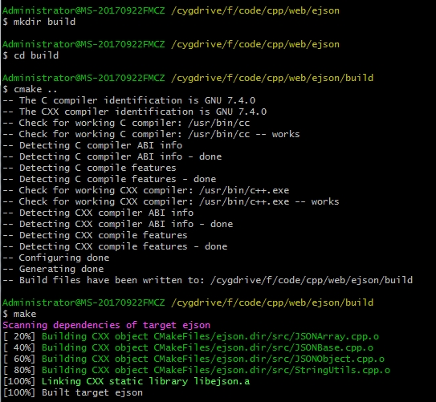
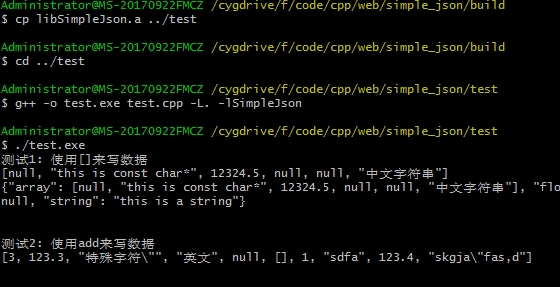
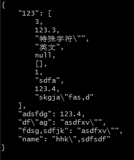
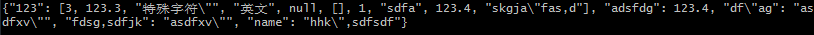
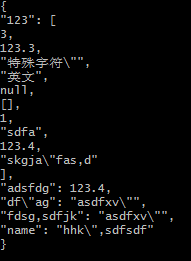

### 编译
编译依赖：
- cmake
- gcc

如果是windows平台推荐使用cygwin套件（可以在windows下编译linux软件），配合clion，开发起来挺方便的。

例如windows平台下（linux下类似），编译静态库的方法如下，编译成功后在build目录下生成libSimpleJson.a静态库。



编译测试程序方法如下：(-lSimpleJson参数表示链接libSimpleJson.a静态库)




### 提供方便的API

这里Json支持的类型有int, float, double, const char* , string,  nullptr(cpp中的空指针)

1. **JSON Array**

   - 使用 [] 操作符写入数据，可以使用cout直接打印输出

     ```cpp
     JSONArray test1(2); // 初始化分配大小，可以会自动拓展容量
     test1[0] = nullptr;
     test1[1] = "this is const char*";
     test1[2] = 12324.5;
     test1[5] = "中文字符串";
     cout << test1 << endl;
     ```

   - 初始化列表构造函数与链式操作

     ```cpp
     JSONArray arr = {123.4, "dfsdf", 23, nullptr}; // 初始化列表 
     arr[0] = 12.314;
     arr[2] = 2335;
     arr[3] = "字符串";
     arr[6] = obj;  // json对象
     arr.add(123456) // 整数
        .add(234.235236) //浮点数
        .add("字符串") //字符串
        .add(nullptr); // null测试
     ```

   - get方法获取数值

     例如 `float f = test1.get<float>(2);`  ，如果类型不正确的话会抛出异常

   - toString方法转换为字符串，toString可选参数，代表缩进的数量。

     例如 `test1.toString(4)` 表示4空格缩进
2. ‘’**JSON Object**

   - 使用 [] 来写入数据

     ```cpp
     // 使用[] 操作对象
     JSONObject test2;
     test2["float"] = 123.456;
     test2["int"] = 24;
     test2["string"] = "this is a string";
     test2["array"] = test1;
     test2["nullptr"] = nullptr;
     cout << test2 << endl;
     ```

   - 更加复杂的初始化方法

     这种方法看起来比较直观，支持object和array的嵌套使用，这是我自己想出来的，有兴趣的朋友可以看下我的实现方法，讨论下有没有更加优秀的实现方式。

     ```cpp
     // obj初始化方法
     JSONObject obj = {
         {"test obj", {"key", "value"}},
         {"int number", 2},
         {"float number", 34.3},
         {"my string", "fsdfsdg"},
         {"nullptr", nullptr},
         {"emptylist", {}},
         {"列表嵌套列表", {1,2.3, "sdf", {1,2.242, "float"}}}, // 列表嵌套
         {"列表嵌套对象和列表", {
             {{"key1", 1234}}, // 被认为是对象
             {"key1", 1234}, // 被认为是列表
             1.23,
             234325
         }},
         {"对象", { // 所有的值都是{key, value}对则认为是嵌套对象
             {"a obj", 1234566},
             {"b obj", "b obj value"},
         }}
     };
     ```

   - 支持链式add的操作

     ```cpp
     obj["int"] = 12325;
     obj["float"] = 24235.235235;
     obj["string"] = "this is a string2";
     obj["null"] = nullptr;
     
     obj.add("int", 123) // 整数
         .add("float", 23.2324) // 浮点数
         .add("string", "this is a string") // 英文字符串
         .add("中文", "这是中文字符串。。。") // 中文字符串
         .add("symbols  \",.[]@!#$%^", "含有特殊符号\"") // 特殊符号
         .add("list", {1, 2.34, "english string", 123.4, "中文字符串"}) // 列表
         .add("this is null", nullptr) // null测试
         .add("object", {{"key1", "value1"}, {"key2", 223}, {"key3", 23.4}}); // 对象
     ```

   - get 方法获取数值

     例如， ` obj->get<string>("string")` 可以获取到键为string的值。

   - toString方法输出字符串，参数为缩进的数量

     例如4空格缩进如下(`obj.toString(4)`)

     

     无缩进（`obj.toString(-1)`）



​	    无空格缩进(   ` obj.toString(0)`)



3. **字符串转换为json对象**

   由于我们不知道字符串是array还是object，我们使用JSONBase类来接受返回的结果。

   （JSONBase中有isJSONArray 和 isJSONArray 方法，可以方便我们进行类型转换）

   例如以下,

   ```cpp
   string parse_str = R"({"name" : "hhk" , "key1": "valu\"e1 ","key2":[1,2,"asd",{"sadf": 123, "sb": 12.3}, 123.3]})";
   JSONBase* a = JSONBase::parse(parse_str);
   cout << *a << endl;
   JSONObject *b = dynamic_cast<JSONObject *>(a); //类型转换
   cout << b->get<string>("key1") << endl;
   cout << b->get<JSONArray>("key2").get<int>(1) << endl;
   ```

   parse方法用于不知道字符串是array还是object，parse_obj方法返回JSONObject，parse_arr方法返回JSONArray。（parse_obj,parse_arr用于明确知道字符串的类型）

   如果字符串不是json字符串，则抛出JSONParseException异常。

   

   